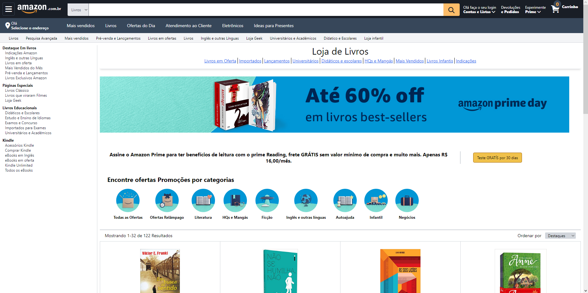

   
   Clone

    

<h2>Pré Visualização💻</h2>
 
<h3>Sobre o projeto📗</h3>

  Projeto <strong>Amazon clone</strong>, é um projeto clone do E-Commerce amazon tentando chegar o mais perto possivel do seu visual original.
  O objetivo desse projeto foi trabalhar o framework <strong>Tailwind CSS</strong> junto com a bilbioteca <strong>React</strong>. Trabalhando
  design responsivo e construção de layout. Divisão em componentes usando React e codigo limpo. 

<a href="https://clone-amazon-topaz.vercel.app">Visualizar projeto 👨‍💻</a>

